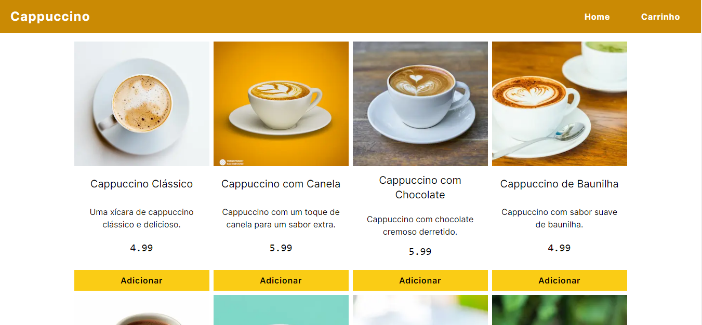
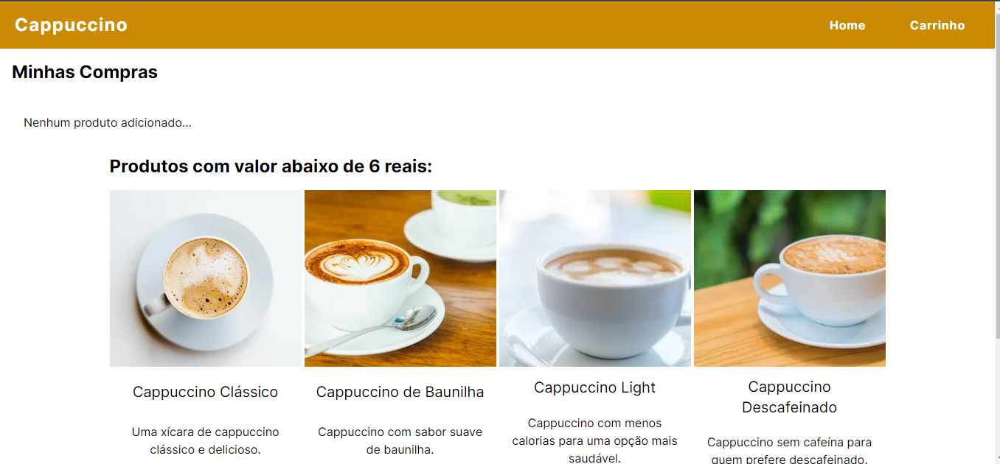

## Projeto Cappuccino - E-commerce de Produtos

O Projeto Cappuccino é um e-commerce simples desenvolvido com React.js que permite aos usuários visualizar uma lista de produtos e adicionar produtos ao carrinho de compras. Este projeto é uma demonstração básica das funcionalidades de um carrinho de compras em um site de comércio eletrônico.

## Funcionalidades

- Visualização de produtos: Os usuários podem ver uma lista de produtos disponíveis.
- Adição ao carrinho: Os usuários podem adicionar produtos ao carrinho de compras.
- Remoção do carrinho: Os usuários podem remover produtos do carrinho de compras.

## Tecnologias Utilizadas

- React.js: Uma biblioteca JavaScript para construção de interfaces de usuário.
- Tailwind CSS: Um framework CSS utilitário para estilização rápida.
- Context API: Usada para gerenciar o estado global do carrinho de compras.
- TypeScript: Linguagem de programação para lógica do cliente.

## Estrutura do Projeto

- `src/`: Contém todos os arquivos relacionados ao código-fonte do projeto.
  - `components/`: Componentes React reutilizáveis.
  - `context/`: Contexto e estado global do carrinho de compras.
  - `data/`: Dados de produtos simulados.
  - `page.tsx`: Ponto de entrada principal da aplicação.
